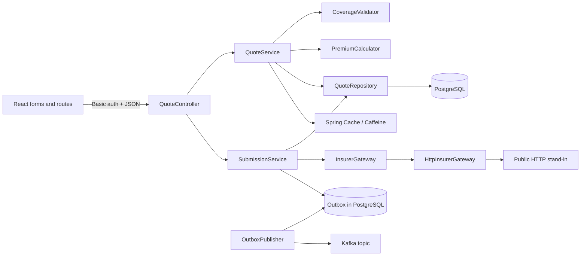
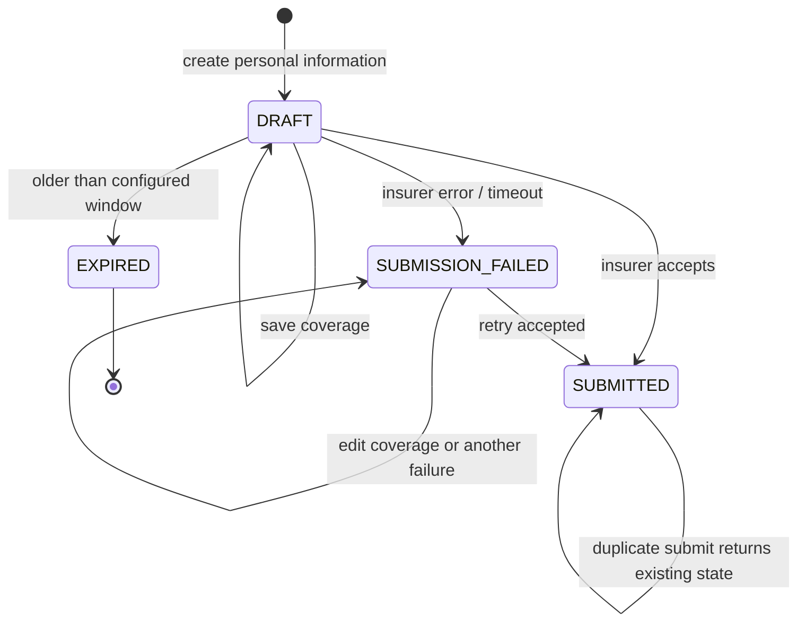
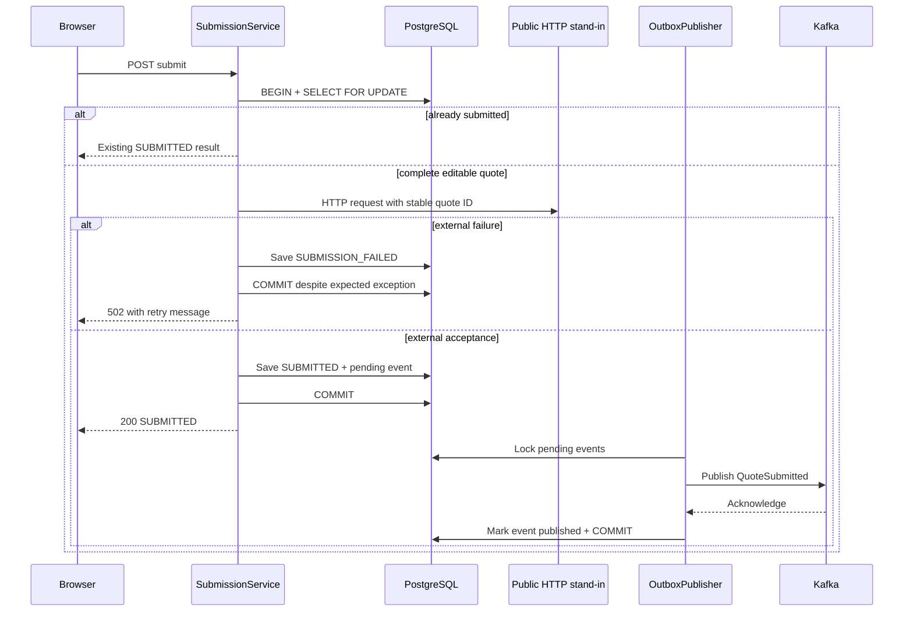

# Walkthrough: from TypeScript to Java and Spring

Read this with the code open. The aim is to predict what a request will do and know where to make a small change, not memorize annotations. Allow three sessions: domain and HTTP (45 minutes), transactions and side effects (60 minutes), then frontend and modifications (45 minutes).

## 1. See the whole system

The browser is responsible for interaction. The API is responsible for truth. A user can bypass React with curl, so age rules, states and prices must be enforced in Java too. Kafka is downstream notification, not the mechanism for returning a quote to the browser.

## 2. Java concepts you already know in another form

| Java here | TypeScript analogy | Important difference |
| --- | --- | --- |
| `package com.felipejaner.quotes.api` | module/folder namespace | Package names match the directory under `src/main/java` |
| `import ...` | ES module imports | Java compiles classes and checks declared types before execution |
| `public class Quote` | class with private properties | JPA can persist its fields; methods restrict mutations |
| `record QuoteResponse(...)` | readonly object type plus constructor | A record generates constructor/accessors/equality; nested collections still need copying |
| `enum CoverageType` | string union | Runtime values exist; JSON must map to declared names |
| `UUID` | branded ID string | A typed value parsed by Spring before reaching service code |
| `BigDecimal` | decimal library | Avoids binary floating-point error for money |
| `Optional<Quote>` | `Quote | undefined` | Absence is handled through `orElseThrow`, not unchecked dereference |
| `List<PremiumFactor>` | array of multiplier functions | An interface with one method can be supplied as a lambda |
| `final` | readonly reference / `const` | Prevents assigning the reference again, not mutating its object |
| `@Something` | decorator-like metadata | Frameworks interpret annotations; they do not all have the same lifecycle |
| `pom.xml` | package.json plus build config | Maven resolves dependencies, compiles Java and runs lifecycle phases |

`src/main/java` is application code. `src/main/resources` contains configuration and migrations copied into the JAR. `src/test/java` is excluded from the runtime application. `target` is generated build output. The wrapper `./mvnw` pins the build tool, while `java.version` pins the compiler target to 17.

## 3. Follow startup

Open `QuotesApplication.java`. `main` is the process entry point. `SpringApplication.run` starts the application context and embedded HTTP server.

Spring scans this package and its children. `@Component`, `@Service`, `@Configuration`, and `@RestController` mark objects Spring manages. These objects are called **beans**. When constructing `SubmissionService`, Spring sees its constructor arguments and supplies the repository, insurer gateway, outbox repository, event publisher and clock. No service locator or hidden global import is required.

The constructor dependency on `InsurerGateway` is an interface. In normal execution, Spring finds `HttpInsurerGateway`. Integration tests replace that bean with a Mockito double. This is dependency inversion: business logic names the capability it needs, while infrastructure supplies it.

`application.yml` configures the connection details. `${API_PASSWORD:local-review-only}` means use the environment variable if present, otherwise use the local default. Flyway runs `V1__create_quotes_and_outbox.sql` before Hibernate validates the entity/schema mapping. `ddl-auto: validate` catches drift rather than rewriting tables.

## 4. Trace POST /quotes

1. `SecurityConfig` runs before the controller. Missing/wrong Basic credentials receive a JSON 401. Browser preflight is handled by CORS without requiring credentials.
2. Jackson converts JSON into `CreateQuoteRequest`. Bean Validation checks `@NotBlank`, `@Email`, age bounds and ZIP format because the controller parameter has `@Valid`.
3. `QuoteController.create` calls `QuoteService.create`.
4. Spring starts a transaction around that service method. The service constructs a `Quote`, whose constructor assigns UUID, DRAFT and timestamps.
5. `QuoteRepository.save` arranges an INSERT. Spring Data implements the repository interface; there is no hand-written implementation class to find.
6. `QuoteResponse.from` creates a separate response object. The entity is not serialized directly, so persistence details and response shape remain separate.
7. The transaction commits before the controller returns a 201 response with Location.

A request can fail before the controller. That is why authentication errors need a security entry point; `@RestControllerAdvice` alone is not enough.

**Try it:** send an invalid email using the curl example. Confirm the response has `fieldErrors.email` and no quote was created. Then locate each of the six files involved.

## 5. Trace coverage and pricing

Open `QuoteService.updateCoverage`. `findForUpdate` loads and locks that quote row. The entity checks that it is editable. `CoverageValidator` then enforces the rule that depends on the already-persisted age. The request has no age field to let the client change the rule.

`CoverageRequest` is an ordinary class, unlike the other request record. This is intentional: Jackson invokes its setters only for supplied properties. `@JsonSetter(nulls = Nulls.FAIL)` rejects a supplied null while permitting an omitted health field. A record with the same null handling rejected omitted values as well; an integration test exposed this.

For someone over 65, four boxed `Boolean` values distinguish missing (`null`) from No (`false`). After validation, `HealthDetails` contains primitive booleans, because absence is no longer allowed. Sets prevent duplicate conditions. A true conditions flag with an empty set is invalid; a false flag with a nonempty set is invalid.

`PremiumCalculator` starts at 50, 100 or 200. Its factors produce 1, 1.5, 1.3, 1.2 or 1.4 using decimal strings. `new BigDecimal("1.3")` is deliberate; constructing from a double can import its binary approximation. The result is rounded once at the end. Medication does not affect the formula.

The result is written through `Quote.selectCoverage`, and an application event asks for cache eviction after commit. Hibernate detects changes to the managed entity and issues UPDATE at flush/commit. That is why this method does not need a second `save` call: **dirty checking** is active inside the transaction.

**Predict before running:** Basic at age 65 costs 50; Basic at age 66 without other factors costs 75; Standard at 70 with one condition, tobacco and spouse costs 327.60. Selecting two conditions still uses 1.3 once.

## 6. States are more than button visibility

`requireEditable` protects changes. `requireSubmittable` adds completeness checks. `SubmissionService` returns early for already submitted quotes before applying the ordinary submittable check. That ordering is how terminal success stays idempotent without making edits legal.

**Try it:** submit before selecting coverage (409), submit a complete quote (200), submit again (200), then patch coverage on the submitted quote (409). Explain why each result is consistent.

## 7. Transactions, failures and retry

A normal unchecked exception causes Spring to roll back a transaction. Here that would erase SUBMISSION_FAILED. The annotation explicitly exempts **only** `InsurerUnavailableException` so this expected business outcome commits. An unexpected database/runtime error still rolls back.

A pessimistic lock makes a simultaneous second submit wait. Once the first transaction commits, the second reads SUBMITTED and returns without calling the insurer or creating another event. The integration test uses two concurrent requests to verify this.

The five-second HTTP timeout limits connection and response wait. Interrupted threads have their interrupted flag restored, rather than silently swallowing cancellation. Non-2xx status codes become a domain exception. No exception details or personal data go to the client logs.

Holding a database lock during HTTP is a conscious simplification. Be ready to name its cost: slow upstream calls tie up database connections and serialize requests for that quote. A larger service would likely move submission to an asynchronous workflow with an in-progress status and recovery policy.

## 8. Why the outbox exists

Without an outbox, these are possible:

- Commit SUBMITTED, then crash before publishing to Kafka: a successful quote has no event.
- Publish to Kafka, then database rollback: consumers see a submission that did not persist.

The outbox stores both records in one database transaction. The worker's PostgreSQL `FOR UPDATE SKIP LOCKED` query takes up to 20 pending events while allowing another worker to skip locked rows. It waits for Kafka acknowledgement before marking delivery.

There is still a crash window **after Kafka acknowledgement and before the publisher's database commit**. The same event can be sent again. That is why the payload contains `eventId`, and the guarantee is at least once. Kafka producer idempotence helps broker retries; it does not replace consumer deduplication across application restarts.

The event intentionally includes quote ID, premium, event ID, type/version and timestamp, but no name, email or health history. A unique `quote_id` constraint prevents a second logical success event for the same quote.

Another crash window exists between external acceptance and the submission database commit. The free stand-in does not implement an insurer's idempotency contract. Do not claim this code solves that distributed-systems problem. A real integration would use provider-supported idempotency keys and reconciliation.

## 9. Caching and expiration

`QuoteService.get` delegates to `QuoteCache`, which uses Spring’s `Cache` abstraction to read/write Caffeine entries keyed by quote ID and generation. Its cached value is an immutable DTO, not a managed JPA entity. Never use a cached quote to decide if a mutation is allowed.

An application `QuoteChanged` event is different from the Kafka event. It stays inside Spring and is used by `QuoteCache.onChange`. `@TransactionalEventListener(AFTER_COMMIT)` waits for a successful database commit before advancing the generation and clearing the cache. It also runs when the expected insurer exception commits the failure state.

`DraftExpirationService` executes one bulk UPDATE in one transaction. Bulk JPQL bypasses normal per-entity dirty checking, so it explicitly increments `version` and clears the persistence context. The job publishes a cache-clear event only if rows changed. It does not loop over quotes and save them separately.

The local cache assumes a single API instance. An in-flight read can return its original snapshot, but its late cache fill uses an obsolete generation and cannot overwrite the entries used by later reads. Every change invalidates all entries, trading extra misses for a simple correctness rule. Entries still have a 30-second TTL. Multiple instances would need coordinated invalidation or a shared cache. Cache correctness here does not mean strict serializable reads; mutation correctness comes from the database.

## 10. Spring's invisible wrapper

`@Transactional` is implemented by proxy objects around your beans. Spring’s optional `@Cacheable` annotation works similarly, though this app now uses the `Cache` API directly to control generation keys. Calling the bean from another bean passes through the wrapper. Calling another annotated method using `this.method()` inside the same class bypasses the proxy.

That is why scheduled trigger methods are in `ScheduledJobs`, while the transactional work is in `DraftExpirationService` and `OutboxPublisher`. A job calls another bean and gets transaction behavior. Tests using `new SubmissionService(...)` verify business logic but do not activate Spring transaction semantics. The PostgreSQL integration tests verify those semantics separately.

## 11. Read the tests by risk

1. `PremiumCalculatorTest`: fixed example, age boundary, multiple conditions, medication neutrality.
2. `CoverageValidatorTest`: missing answers, false/empty fields for younger applicants, consistent conditions.
3. `SubmissionServiceTest`: incomplete requests, expected failure/retry, repeated success, no repeated effects.
4. `HttpInsurerGatewayTest`: actual local network responses, 503 and timeout translation.
5. `QuoteApiIT`: full Spring + real PostgreSQL: auth/CORS, validation, committed failure, concurrent submit, outbox retry, cache invalidation and batch expiration.

JaCoCo measures executed code; it does not prove correctness. The important assertions are observable outcomes: one event, no second insurer call, failure persisted after an exception, and expired quotes rejected.

## 12. A useful debugging routine

Start at the HTTP status and error code. Locate the controller method, then its service, then the domain rule or repository. Read the test that covers that path. Reproduce it with curl. Change one layer at a time, run the focused test, then `./mvnw verify` before committing.

Do not add a controller workaround for a domain bug. Do not change the fixed formula to make a test pass. Do not catch all exceptions and return success. When explaining a choice, state the requirement, the code that enforces it, and one limitation.

## Official references

- [Spring Boot 3.5 system requirements](https://docs.spring.io/spring-boot/3.5/system-requirements.html): Java and Maven requirements for the selected line.
- [Spring Framework cache abstraction](https://springframework.org/spring-framework/reference/6.2/integration/cache.html): what Spring's cache annotations do.
- [Apache Kafka Docker guide](https://kafka.apache.org/40/getting-started/docker/): the official Kafka image used in Compose.
